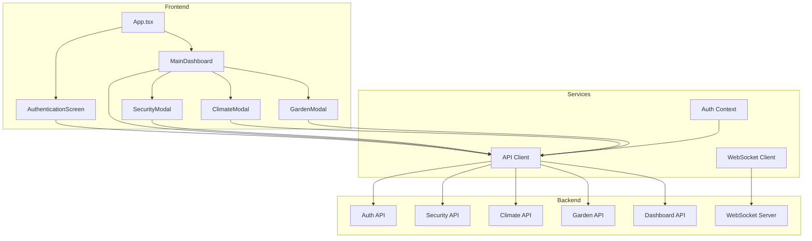

# Frontend API Integration Plan

## Overview
This document outlines the plan to migrate the frontend from static data to backend API integration while ensuring no data or features are dropped and no workflows are broken.

---

## Architecture Overview



---

## Phase 1: Infrastructure Setup

### 1.1 Create API Client Service Layer
**File:** `client/src/lib/api.ts` (new)

**Purpose:** Centralized HTTP client for all API requests

**Features:**
- Base URL configuration (`http://localhost:3000/api/v1`)
- Request/response interceptors for authentication
- Token management (attach to headers)
- Error handling with proper status codes
- Type-safe API functions for all endpoints

**API Endpoints to Implement:**
- Authentication: `loginPin`, `loginBiometric`, `logout`, `refreshToken`
- Security: `getSecurityStatus`, `armSecurity`, `triggerPanic`, `controlGarage`, `getGarageStatus`, `controlDoor`
- Climate: `getClimateStatus`, `setTemperature`, `setFanSpeed`, `setMode`, `applySettings`
- Garden: `getGardenStatus`, `toggleZone`, `setAllZones`, `setSchedule`, `getWaterTank`, `refillTank`
- Dashboard: `getDashboardData`
- Activity: `getActivityLogs`, `getActivityLog`

---

### 1.2 Create Authentication Context
**File:** `client/src/contexts/AuthContext.tsx` (new)

**Purpose:** Manage authentication state and token across the app

**Features:**
- Store JWT token in localStorage
- Provide login/logout functions
- Provide authenticated user data
- Auto-refresh token on expiration
- WebSocket connection management

**State:**
```typescript
interface AuthState {
  isAuthenticated: boolean;
  user: User | null;
  token: string | null;
  login: (pin: string) => Promise<void>;
  loginBiometric: (data: string, type: string) => Promise<void>;
  logout: () => void;
}
```

---

### 1.3 Create WebSocket Client
**File:** `client/src/lib/websocket.ts` (new)

**Purpose:** Real-time updates from backend

**Features:**
- Connect to WebSocket with token
- Subscribe/unsubscribe to channels
- Handle incoming events
- Auto-reconnect on disconnect
- Event callbacks for components

**Channels:**
- `security.status.changed`
- `security.alarm.triggered`
- `climate.status.changed`
- `garden.zone.changed`
- `lighting.status.changed`
- `activity.log.new`
- `camera.motion.detected`

---

## Phase 2: Component Updates

### 2.1 Update AuthenticationScreen
**File:** `client/src/app/components/AuthenticationScreen.tsx`

**Changes:**
- Replace `onAuthenticate` callback with actual API calls
- Call `api.loginPin()` when PIN is entered
- Call `api.loginBiometric()` for biometric scan
- Store token in AuthContext
- Handle loading states during API calls
- Display error messages from API responses

**Preserved Features:**
- PIN input with visual feedback
- Biometric scan animation
- Status indicators (locked, scanning, error)
- All visual effects and animations

---

### 2.2 Update MainDashboard
**File:** `client/src/app/components/MainDashboard.tsx`

**Changes:**
- Fetch dashboard data from `api.getDashboardData()` on mount
- Subscribe to WebSocket events for real-time updates
- Update state when WebSocket events received
- Handle loading and error states

**Preserved Features:**
- All widget cards (Security, Climate, Garden, Lighting)
- Visual effects and animations
- Panic button functionality
- Quick toggle buttons
- All styling and layout

**API Integration:**
```typescript
// On mount
const dashboard = await api.getDashboardData();
setSecurityArmed(dashboard.security.armed);
setTemperature(dashboard.climate.temperature);
setLightsOn(dashboard.lighting.masterOn);

// WebSocket subscriptions
ws.subscribe(['security.status.changed', 'climate.status.changed', 'lighting.status.changed']);
ws.on('security.status.changed', (data) => setSecurityArmed(data.armed));
```

---

### 2.3 Update SecurityModal
**File:** `client/src/app/components/SecurityModal.tsx`

**Changes:**
- Fetch security status from `api.getSecurityStatus()` on mount
- Call `api.controlGarage()` for garage door
- Call `api.controlDoor()` for individual doors
- Call `api.triggerPanic()` for panic alert
- Fetch activity logs from `api.getActivityLogs()`
- Subscribe to WebSocket for real-time updates

**Preserved Features:**
- Garage door visual states (closed, opening, open, obstacle)
- Door lock controls
- Live camera feed placeholder
- Activity log display
- All animations and visual effects

**API Integration:**
```typescript
// Fetch initial data
const status = await api.getSecurityStatus();
const logs = await api.getActivityLogs();

// Garage control
await api.controlGarage({ action: 'open' });

// Panic alert
await api.triggerPanic({ location: 'home', type: 'emergency' });

// WebSocket updates
ws.on('security.status.changed', updateSecurityStatus);
ws.on('activity.log.new', addLogEntry);
```

---

### 2.4 Update ClimateModal
**File:** `client/src/app/components/ClimateModal.tsx`

**Changes:**
- Fetch climate status from `api.getClimateStatus()` on mount
- Call `api.setTemperature()` when dial changes
- Call `api.setFanSpeed()` for fan speed
- Call `api.setMode()` for mode selection
- Call `api.applySettings()` when Apply button clicked
- Subscribe to WebSocket for real-time updates

**Preserved Features:**
- Circular temperature dial with drag interaction
- Fan speed selection buttons
- Mode selection (cool, heat, eco)
- Status display (current temp, humidity, power)
- All animations and visual effects

**API Integration:**
```typescript
// Fetch initial data
const status = await api.getClimateStatus();
setTemperature(status.targetTemperature);
setFanSpeed(status.fanSpeed);
setMode(status.mode);

// Update temperature
await api.setTemperature({ temperature: newTemp });

// Apply all settings
await api.applySettings({
  temperature,
  fanSpeed,
  mode
});

// WebSocket updates
ws.on('climate.status.changed', updateClimateStatus);
```

---

### 2.5 Update GardenModal
**File:** `client/src/app/components/GardenModal.tsx`

**Changes:**
- Fetch garden status from `api.getGardenStatus()` on mount
- Call `api.toggleZone()` for individual zone control
- Call `api.setAllZones()` for all on/off
- Call `api.setSchedule()` for watering schedule
- Call `api.getWaterTank()` for tank status
- Call `api.refillTank()` for refill
- Subscribe to WebSocket for real-time updates

**Preserved Features:**
- Zone map visualization with house
- Zone toggle buttons with animations
- Watering schedule time slider
- Water tank level visualization
- All animations and visual effects

**API Integration:**
```typescript
// Fetch initial data
const status = await api.getGardenStatus();
const tank = await api.getWaterTank();
setActiveZones(status.zones.filter(z => z.active).map(z => z.id));
setTankLevel(tank.level);

// Toggle zone
await api.toggleZone(zoneId, { active: true });

// Set schedule
await api.setSchedule({
  time: '18:00',
  duration: 30,
  zones: [1, 2, 3]
});

// Refill tank
await api.refillTank();

// WebSocket updates
ws.on('garden.zone.changed', updateZoneStatus);
```

---

## Phase 3: Error Handling & Loading States

### 3.1 Add Loading States
**Approach:**
- Add `isLoading` state to each component
- Show skeleton loaders or spinners during API calls
- Disable buttons during pending operations
- Maintain visual consistency

### 3.2 Add Error Handling
**Approach:**
- Catch API errors and display user-friendly messages
- Use toast notifications for errors
- Implement retry logic for failed requests
- Handle network errors gracefully
- Maintain app functionality during errors

### 3.3 Add Offline Support
**Approach:**
- Detect network status
- Cache API responses locally
- Allow basic functionality when offline
- Sync changes when connection restored

---

## Phase 4: Testing & Validation

### 4.1 Component Testing
**Test Cases:**
- Authentication flow (PIN and biometric)
- Dashboard data loading and display
- Security modal controls (garage, doors, panic)
- Climate modal controls (temperature, fan, mode)
- Garden modal controls (zones, schedule, tank)
- WebSocket real-time updates
- Error states and recovery

### 4.2 Integration Testing
**Test Cases:**
- Full user journey from login to dashboard
- Modal open/close workflows
- Multiple simultaneous API calls
- WebSocket connection and reconnection
- Token refresh flow
- Logout and cleanup

### 4.3 Visual Regression Testing
**Verify:**
- All animations work correctly
- No layout shifts during loading
- Color schemes remain consistent
- Responsive design maintained
- All hover effects work
- No console errors

---

## Implementation Order

1. **Infrastructure** (Foundation)
   - Create API client service
   - Create Auth context
   - Create WebSocket client

2. **Authentication** (Entry Point)
   - Update AuthenticationScreen
   - Test login flow

3. **Dashboard** (Main View)
   - Update MainDashboard
   - Test data loading

4. **Modals** (Feature Views)
   - Update SecurityModal
   - Update ClimateModal
   - Update GardenModal
   - Test each modal independently

5. **Integration** (End-to-End)
   - Connect all components
   - Test full user flows
   - Verify WebSocket updates

6. **Polish** (Final Touches)
   - Add loading states
   - Add error handling
   - Performance optimization
   - Final testing

---

## Risk Mitigation

### Data Loss Prevention
- Keep all existing state management logic
- Only replace data sources, not state logic
- Maintain default values as fallbacks
- Test with empty API responses

### Workflow Preservation
- Keep all event handlers unchanged
- Maintain all callback patterns
- Preserve all visual feedback
- Ensure modal open/close logic works

### Backward Compatibility
- Support both static and API modes during transition
- Feature flag for easy rollback
- Gradual migration approach
- Extensive testing before deployment

---

## Success Criteria

✅ All components fetch data from backend APIs
✅ Authentication flow works with PIN and biometric
✅ Dashboard displays real-time data
✅ All modal controls update backend state
✅ WebSocket events trigger UI updates
✅ Loading states display during API calls
✅ Errors are handled gracefully
✅ No features are dropped
✅ No workflows are broken
✅ Visual design remains identical
✅ Performance is not degraded
